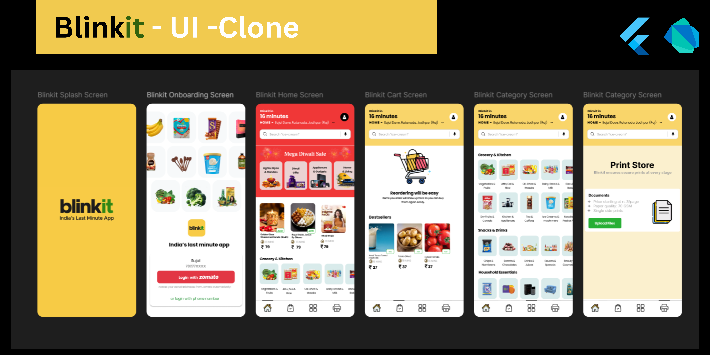

# BlinkIt UI Clone

A Flutter project replicating the BlinkIt app’s user interface. This project focuses solely on creating a clean, static UI with a well-maintained codebase and modular design.

---

## 📌 About the Project

This project demonstrates expertise in Flutter development by recreating the BlinkIt app's user interface. While the project is static and does not include backend integration, it is designed with a professional approach, focusing on a clean code structure and modular UI components.

---

## 🎯 Features

- **Static UI**: Implements a pixel-perfect replication of the BlinkIt app UI.
- **Cross-Platform Design**: Compatible with both Android and iOS platforms.
- **Reusable Components**: Built using Flutter widgets to encourage reusability and ease of updates.
- **Responsive Layouts**: Optimized for different screen sizes and resolutions.

---

## 📸 Screenshots

| Home Screen 
|-------------
|  

---

## 🚀 Getting Started

Follow these steps to run the project locally on your machine.

### Prerequisites

Ensure you have the following installed:
- **Flutter SDK** ([Install Flutter](https://flutter.dev/docs/get-started/install))
- **Dart SDK** (comes with Flutter installation)
- **Android Studio** or **VS Code** (with Flutter and Dart plugins)
- A physical device or emulator to test the application

### Installation

1. Clone the repository:
   ```bash
   git clone https://github.com/sathipe123/blinkit-ui-clone.git
